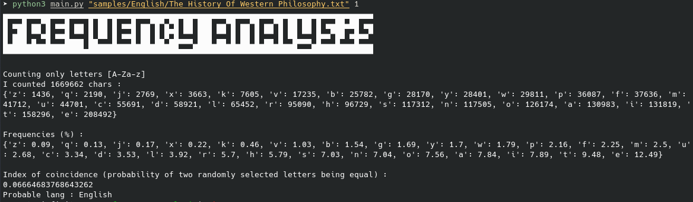
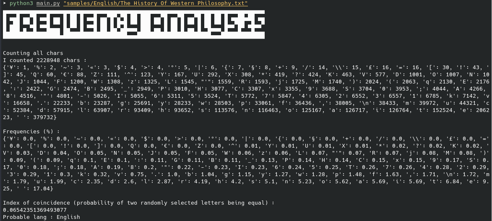
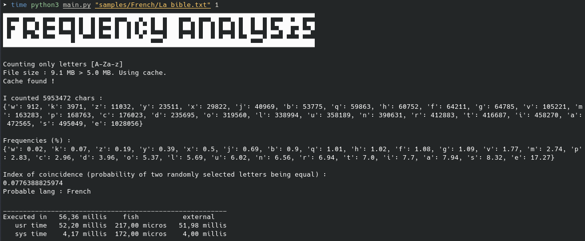

<a name="readme-top"></a>

[![Contributors][contributors-shield]][contributors-url]
[![Forks][forks-shield]][forks-url]
[![Stargazers][stars-shield]][stars-url]
[![Issues][issues-shield]][issues-url]
[![MIT License][license-shield]][license-url]
[![LinkedIn][linkedin-shield]][linkedin-url]


<br />
<div align="center">
  <a href="https://github.com/lcram33/frequency_analysis">
    
  </a>

  <h1 align="center">Frequency analysis</h1>
  
  <h2 align="center">
    A command line program to try to guess the language of a text.
  </h2>

  <h3 align="center">
    <br />
    <a href="https://github.com/lcram33/frequency_analysis/issues">Report Bug</a>
    ·
    <a href="https://github.com/lcram33/frequency_analysis/issues">Request Feature</a>
  </h3>
</div>


<!-- ABOUT THE PROJECT -->
## About The Project






<p align="left">
  A simple tool for cryptanalysis that counts the characters of a text, give their frequencies and calculates the index of coincidence (unique to each language), to try to guess the language of this text.
</p>


### Cache

<p align="left">
  A cache system is implemented, to avoid re-calculating on large files (> 5 MB). It consists in just keeping the number of chars for such files. Checking md5 to distinguish files.
</p>





### Built With

<a href="https://www.python.org">
  
</a>


<!-- GETTING STARTED -->
## Getting Started

To get a local copy up and running follow these simple example steps.


### Prerequisites

python3 (should come with your favorite distro)
  ```sh
  sudo apt update && sudo apt install python3
  ```


### Installation

1. Clone the repo
   ```sh
   git clone https://github.com/lcram33/frequency_analysis.git
   ```
2. cd into the created folder
   ```sh
   cd frequency_analysis
   ```

3. Start the program
   ```sh
   python3 main.py path_to_file
   ```


<!-- USAGE EXAMPLES -->
## Usage

```sh
python3 main.py path_to_file <1>
```

The '1' after the path tells the program to only count letters, not other symbols. 

## Samples provided

All the following should be free to use. If not, please contact me so I can remove the item.

Those were not chosen with any other purpose than testing this program (e.g. the bible was chosen for the size of the resulting text file).

There are more samples in some languages (e.g. French) as the coincidence rate tends to vary more.


### English

* [One hundred years in Ceylon, or, The centenary volume of the Church Missionary Society in Ceylon, 1818-1918](https://archive.org/details/yearsinceylon00balduoft), Balding, John William
* [The History Of Western Philosophy](https://archive.org/details/TheHistoryOfWesternPhilosophy), Bertrand Russell
* Holy Bible, Authorized (King James) Version, [Textfile 930105](https://www.o-bible.com/download/kjv.txt).


### French

* [L'art du peintre, doreur, vernisseur, et du fabricant de couleurs](https://archive.org/details/peintredoreurver00wati/) : ouvrage nécessaire aux amateurs, aux propriétaires qui veulent décorer leur séjour, et aux artistes qui s'adonnent à peindre, dorer et vernir toutes les parties du bâtiment, ainsi que les meubles, bijoux, équipages et laques, Watin, Jean-Félix, b. 1728
* [Histoire de la ville et des seigneurs de Cançon en Agenais](https://archive.org/details/histoiredelavill00mass/) depuis les temps les plus reculés jusqu'en 1789, Massip, Lucien
* [Cultes, mythes et religions](https://archive.org/details/cultesmythesetre04reinuoft), Reinach, Salomon, 1858-1932
* [La Bible, Ancien Testament TOB](https://archive.org/details/collectiflabibleancientestamenttraductiozlib.org)
* [Post-scriptum de ma vie](https://archive.org/details/postscriptumdema00hugo/), Hugo, Victor, 1802-1885
* [Mémoires d'Olivier de La Marche](https://archive.org/details/mmoiresdolivie04lamauoft), maître d'hôtel et capitaine des gardes de Charles le Téméraire, pub. pour la Société de l'histoire de France par Henri Beaune et J. d'Arbaumont


## Other program on this repo

<i>calculate_indexes.py</i> calculates the average index of coincidence for each languages, using all the samples.


<!-- ROADMAP -->
## Roadmap
<h3>
- 🗹 Base program <br>
- ☐ Add more samples + of more languages
</h3>

See the [open issues](https://github.com/lcram33/frequency_analysis/issues) for a full list of proposed features (and known issues).


<!-- CONTRIBUTING -->
## Contributing

Contributions are what make the open source community such an amazing place to learn, inspire, and create. Any contributions you make are **greatly appreciated**.

If you have a suggestion that would make this better, please fork the repo and create a pull request. You can also simply open an issue with the tag "enhancement".
Don't forget to give the project a star! Thanks again!

1. Fork the Project
2. Create your Feature Branch (`git checkout -b feature/AmazingFeature`)
3. Commit your Changes (`git commit -m 'Add some AmazingFeature'`)
4. Push to the Branch (`git push origin feature/AmazingFeature`)
5. Open a Pull Request


<!-- LICENSE -->
## License

Distributed under the MIT License. See `LICENSE` for more information.


<!-- CONTACT -->
## Contact

✉️ lcram33@pm.me

Project Link: [https://github.com/lcram33/frequency_analysis](https://github.com/lcram33/frequency_analysis)


## Credits

<a href="https://www.flaticon.com/free-icons/analysis" title="analysis icons">Analysis icons created by monkik - Flaticon</a>


<!-- MARKDOWN LINKS & IMAGES -->
<!-- https://www.markdownguide.org/basic-syntax/#reference-style-links -->
[contributors-shield]: https://img.shields.io/github/contributors/lcram33/frequency_analysis.svg?style=for-the-badge
[contributors-url]: https://github.com/lcram33/frequency_analysis/graphs/contributors
[forks-shield]: https://img.shields.io/github/forks/lcram33/frequency_analysis.svg?style=for-the-badge
[forks-url]: https://github.com/lcram33/frequency_analysis/network/members
[stars-shield]: https://img.shields.io/github/stars/lcram33/frequency_analysis.svg?style=for-the-badge
[stars-url]: https://github.com/lcram33/frequency_analysis/stargazers
[issues-shield]: https://img.shields.io/github/issues/lcram33/frequency_analysis.svg?style=for-the-badge
[issues-url]: https://github.com/lcram33/frequency_analysis/issues
[license-shield]: https://img.shields.io/github/license/lcram33/frequency_analysis.svg?style=for-the-badge
[license-url]: https://github.com/lcram33/frequency_analysis/blob/master/LICENSE
[linkedin-shield]: https://img.shields.io/badge/-LinkedIn-black.svg?style=for-the-badge&logo=linkedin&colorB=555
[linkedin-url]: https://linkedin.com/in/marc-lecointre